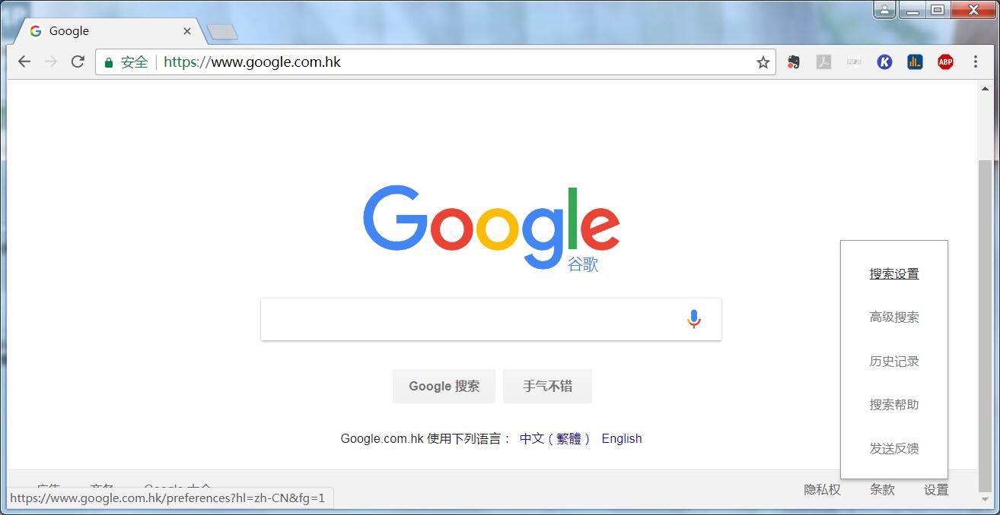
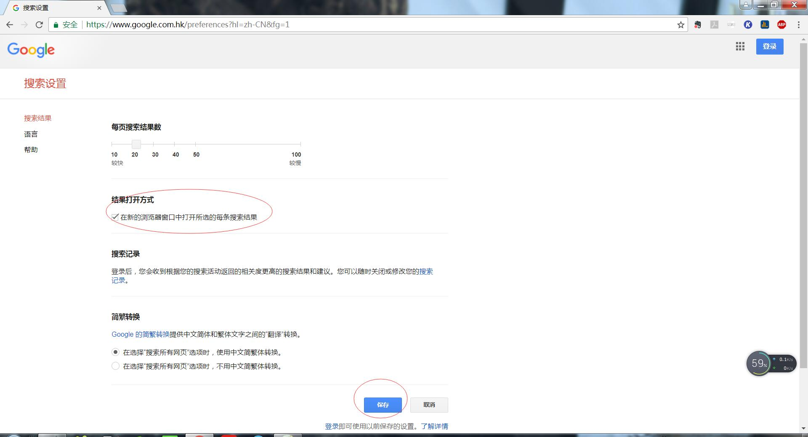

# chrome设置

Google Chrome在书签栏打开新网页都在同一个标签页打开解决办法：

* 小伙伴 请注意[https://www.google.com/](https://www.google.com/)
与[https://www.google.com.hk/](https://www.google.com.hk/)是两个不同的网址，需要分开独立设置的；如果只用到一个，设置一个就好了；
